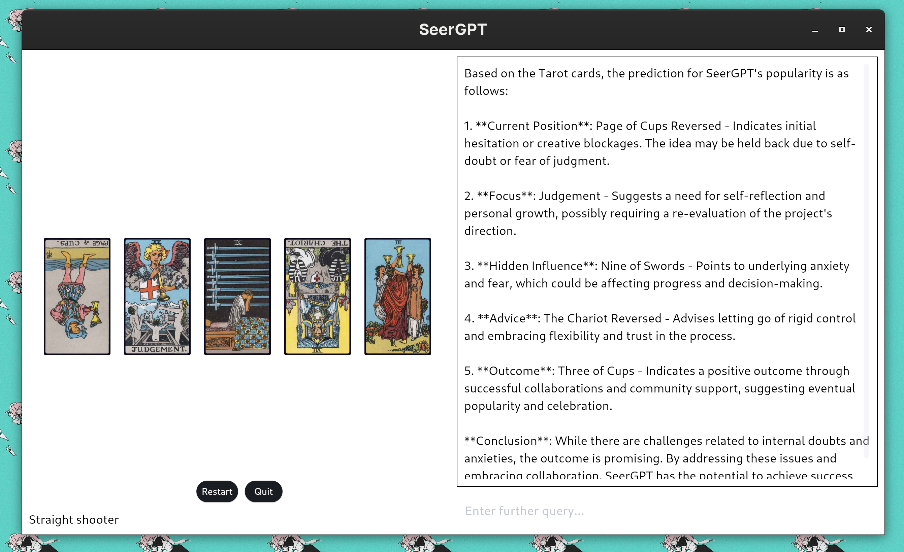

SeerGPT uses RAG with Reasoning models to generate fun, accurate Tarot Readings!

Features:

-   🃏 11 unique spreads for different types of questions!
-   ✨ Supports OpenRouter, OpenAI and Anthropic API endpoints!
-   🪄 Has a gorgeous UI, made with flet

# Installation

## From `pip`

Simply run

    pip install SeerGPT

## From Source

Run the following commands:

    python3 -m venv .venv
    source .venv/bin/activate
    python3 -m pip install -r requirements.txt
    python3 main.py

# Usage

Upon running the program for the first time, you will be prompted to enter details for your LLM provider.
Once you fill in these details, you can enter your query, and the program will handle the rest!

# Issues

Please open an issue on the [Github page](https://github.com/matchcase/SeerGPT).

# Acknowledgements

The cards have been taken from CC0 scans of the [Rider-Waite Tarot deck](https://en.wikipedia.org/wiki/Rider%E2%80%93Waite_Tarot) uploaded by luciellaes on their [itch.io page](https://luciellaes.itch.io/rider-waite-smith-tarot-cards-cc0).

# License

This program is licensed under the GNU General Public License v3, © Sarthak Shah 2025.

